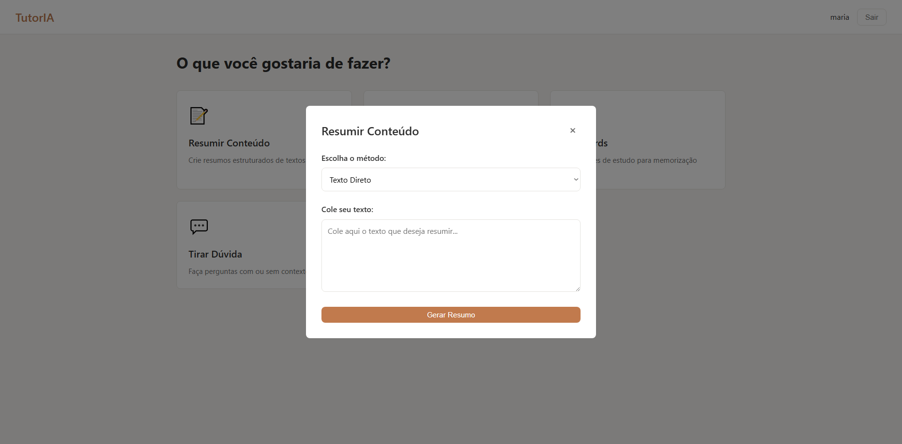
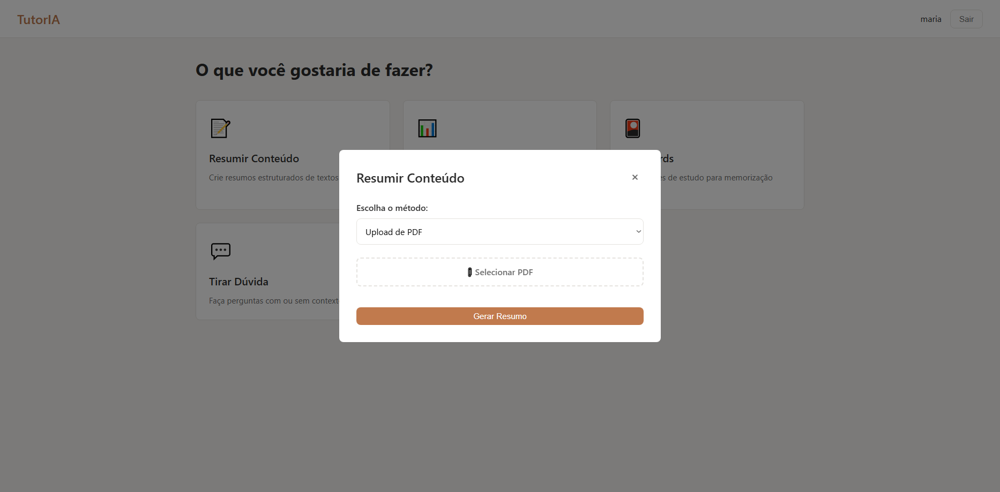
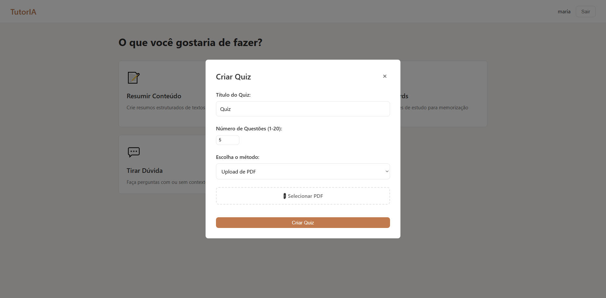
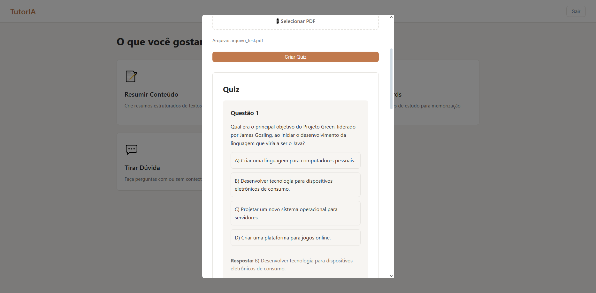
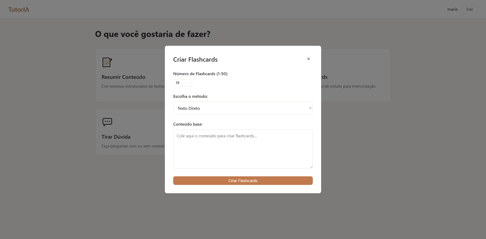
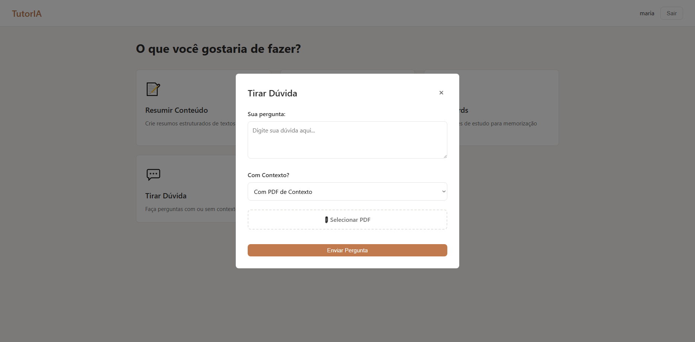
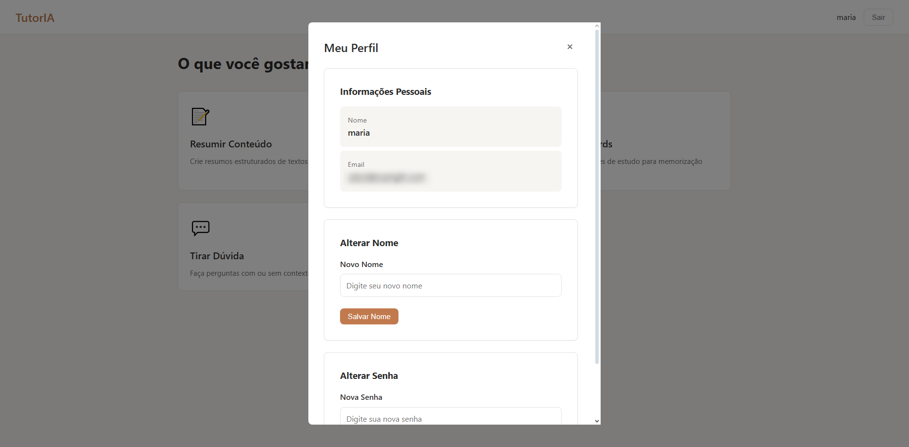
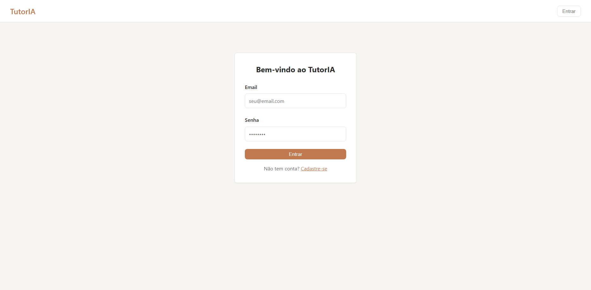

# TutorIA - AI Study Assistant

## 📌 Overview

TutorIA is a web-based educational application that leverages Artificial Intelligence (Gemini API) to assist students in their study activities. The system allows generating summaries, quizzes, flashcards, and answering questions from text or PDF documents.

> Versão em Português: [Clique Aqui](readme.md)

> This code was created for learning and personal development purposes. I'm more than happy if you use it as a base for your own studies, but I kindly ask that you give proper credit. Respecting each other's work and effort strengthens our dev community.

---

### Main Features

* **Summarize Content**: Generates structured Markdown summaries from text or PDFs.
* **Create Quiz**: Generates multiple-choice questions with answer keys.
* **Flashcards**: Creates study cards for memorization.
* **Ask Questions**: Answers questions with or without context (text/PDF).
* **User Management**: Full authentication and profile system.

---

## 🛠️ Technologies

* **Backend**: Java 17+ with Spark Framework
* **Build**: Maven
* **Database**: PostgreSQL
* **AI**: Google Gemini API
* **Authentication**: JWT
* **PDF Processing**: Apache PDFBox
* **Frontend**: HTML5, CSS3, JavaScript (Vanilla)
* **Security**: BCrypt for password hashing

---

## 🏗️ Layered Architecture

```
└── 📁 com.tutoria
    ├── 📁 controller        # Controller Layer (HTTP Routes)
    │   ├── AIController.java
    │   ├── AuthController.java
    │   └── UserController.java
    ├── 📁 dao              # Data Access Layer
    │   └── UserDAO.java
    ├── 📁 model            # Data Models
    │   ├── Duvida.java
    │   ├── Flashcard.java
    │   ├── QuestaoQuiz.java
    │   ├── Quiz.java
    │   ├── Resumo.java
    │   └── User.java
    ├── 📁 service          # Business Logic Layer
    │   ├── AIService.java
    │   ├── AuthService.java
    │   └── UserService.java
    ├── 📁 util             # Utilities
    │   ├── APIRouteTester.java
    │   ├── ConfigLoader.java
    │   ├── LogTest.java
    │   └── PDFReader.java
    └── App.java            # Main Class
```

---

### 📦 Models (Data Models)

* **User.java**: Represents system users (id, name, email, password)
* **Quiz.java**: Quiz structure with title and list of questions
* **QuestaoQuiz.java**: Individual question with options and correct answer
* **Flashcard.java**: Study card with front (question) and back (answer)
* **Duvida.java**: Structure for questions and answers
* **Resumo.java**: Stores original text and generated summary

---

### 🎮 Controllers

* **AIController.java**: Manages all AI-related routes.

  * Summaries (text/PDF)
  * Quiz (text/PDF)
  * Flashcards (text/PDF)
  * Questions (simple/context/PDF)
* **AuthController.java**: Authentication (login/logout)
* **UserController.java**: User management (registration, profile, update)

---

### ⚙️ Services

* **AIService.java**: Handles communication with Gemini API.

  * Prompt processing
  * JSON response parsing
  * Security and parameter configuration
* **AuthService.java**: JWT token generation and validation
* **UserService.java**: Business logic for users

---

### 💾 DAO (Data Access Object)

* **UserDAO.java**: Database operations.

  * User CRUD
  * Authentication
  * Password hashing with BCrypt

---

### 🔧 Utilities

* **APIRouteTester.java**: Automated tool to test all API endpoints (generates detailed report)
* **ConfigLoader.java**: Loads settings from `application.properties` and environment variables
* **LogTest.java**: SLF4J/Logback configuration test
* **PDFReader.java**: Extracts text from PDF files using Apache PDFBox

---

### 📁 Resources

* **public/index.html**: Full web interface (SPA)
* **application.properties**: Configuration (DB, JWT, API keys)

---

## 📡 Endpoints Table

### Authentication

| Method | Endpoint    | Description           | Requires Auth |
| ------ | ----------- | --------------------- | ------------- |
| POST   | `/login`    | User login            | ❌             |
| POST   | `/logout`   | User logout           | ✅             |
| POST   | `/register` | New user registration | ❌             |

### User

| Method | Endpoint    | Description         | Requires Auth |
| ------ | ----------- | ------------------- | ------------- |
| GET    | `/me`       | Logged-in user data | ✅             |
| PUT    | `/me/nome`  | Update name         | ✅             |
| PUT    | `/me/senha` | Update password     | ✅             |

### AI - Summary

| Method | Endpoint                | Description    | Body/FormData        | Requires Auth |
| ------ | ----------------------- | -------------- | -------------------- | ------------- |
| POST   | `/api/ai/resumir/texto` | Summarize text | `{ "texto": "..." }` | ✅             |
| POST   | `/api/ai/resumir/pdf`   | Summarize PDF  | `pdf: File`          | ✅             |

### AI - Quiz

| Method | Endpoint             | Description           | Body/FormData                                                 | Requires Auth |
| ------ | -------------------- | --------------------- | ------------------------------------------------------------- | ------------- |
| POST   | `/api/ai/quiz/texto` | Create quiz from text | `{ "conteudo": "...", "titulo": "...", "numeroQuestoes": 5 }` | ✅             |
| POST   | `/api/ai/quiz/pdf`   | Create quiz from PDF  | `pdf: File, titulo: string, numeroQuestoes: number`           | ✅             |

### AI - Flashcards

| Method | Endpoint                   | Description                 | Body/FormData                              | Requires Auth |
| ------ | -------------------------- | --------------------------- | ------------------------------------------ | ------------- |
| POST   | `/api/ai/flashcards/texto` | Create flashcards from text | `{ "conteudo": "...", "numeroCards": 10 }` | ✅             |
| POST   | `/api/ai/flashcards/pdf`   | Create flashcards from PDF  | `pdf: File, numeroCards: number`           | ✅             |

### AI - Questions

| Method | Endpoint                     | Description                | Body/FormData                              | Requires Auth |
| ------ | ---------------------------- | -------------------------- | ------------------------------------------ | ------------- |
| POST   | `/api/ai/perguntar`          | Simple question            | `{ "pergunta": "..." }`                    | ✅             |
| POST   | `/api/ai/perguntar/contexto` | Question with text context | `{ "pergunta": "...", "contexto": "..." }` | ✅             |
| POST   | `/api/ai/perguntar/pdf`      | Question with PDF context  | `pergunta: string, pdf: File`              | ✅             |

### Utilities

| Method | Endpoint         | Description          | Requires Auth |
| ------ | ---------------- | -------------------- | ------------- |
| GET    | `/health`        | General health check | ❌             |
| GET    | `/api/ai/health` | AI API health check  | ✅             |
| GET    | `/teste`         | Basic API test       | ❌             |

---

## 🧪 How to Test the API

### Option 1: Web Interface

1. Access `http://localhost:4567`
2. Create an account or log in
3. Use the graphical interface to test all features

### Option 2: APIRouteTester (Automated)

```bash
# Run the APIRouteTester class
mvn exec:java -Dexec.mainClass="com.tutoria.util.APIRouteTester"

# Or compile and run directly
javac -cp "target/classes:target/dependency/*" src/main/java/com/tutoria/util/APIRouteTester.java
java -cp "target/classes:target/dependency/*" com.tutoria.util/APIRouteTester
```

The tester generates a full report `relatorio_testes_YYYYMMDD_HHMMSS.txt` with:

* Status of each endpoint
* Responses received
* Error validations
* Success rate

**Important**: To use APIRouteTester without modifications, you must temporarily disable authentication or add AI routes to public routes.

### Option 3: HTTP Tools

#### Postman / Insomnia / Thunder Client

**1. Login to obtain token:**

```http
POST http://localhost:4567/login
Content-Type: application/json

{
  "email": "your@email.com",
  "senha": "yourpassword"
}

# Response: { "token": "eyJhbGciOiJIUzI1NiJ9..." }
```

**2. Use token in requests:**

```http
POST http://localhost:4567/api/ai/resumir/texto
Authorization: Bearer YOUR_TOKEN_HERE
Content-Type: application/json

{
  "texto": "Photosynthesis is the process..."
}
```

**3. PDF Upload:**

```http
POST http://localhost:4567/api/ai/quiz/pdf
Authorization: Bearer YOUR_TOKEN_HERE
Content-Type: multipart/form-data

pdf: [select file]
titulo: "Biology Quiz"
numeroQuestoes: 5
```

---

## 🚀 Running Locally

### Prerequisites

* Java 17 or higher
* Maven 3.6+
* PostgreSQL 12+
* Google AI Studio account (for Gemini API)

### Step 1: Clone the Repository

```bash
git clone <your-repo>
cd tutoria
```

### Step 2: Configure Database

```sql
-- Create database
CREATE DATABASE tutoria;

-- The table will be created automatically on first run
```

### Step 3: Configure application.properties

```bash
# Copy example file
cp src/main/resources/application.properties.example src/main/resources/application.properties

# Edit with your credentials
nano src/main/resources/application.properties
```

**Content of application.properties:**

```properties
# PostgreSQL Connection URL
db.url=jdbc:postgresql://localhost:5432/tutoria
db.user=your_postgres_user
db.password=your_postgres_password

# JWT Secret (minimum 32 characters)
jwt.secret=your_secure_jwt_secret_code_with_32+_characters

# Gemini API Key
ai.api.key=your_gemini_key_here
```

### Step 4: Obtain Gemini API Key

1. Go to Google AI Studio
2. Log in with your Google account
3. Click "Get API Key" or "Create API Key"
4. Select or create a project
5. Copy the generated key (format: `AIzaSy...`)
6. Paste into `application.properties` under `ai.api.key`

**Gemini Free Limits:**

* 15 requests per minute
* 1M tokens per minute
* 1,500 requests per day

### Step 5: Compile and Run

```bash
# Install dependencies
mvn clean install

# Run application
mvn exec:java -Dexec.mainClass="com.tutoria.App"

# Or using Java directly
java -cp target/classes:target/dependency/* com.tutoria.App
```

### Step 6: Access the Application

```
Frontend: http://localhost:4567
API: http://localhost:4567/api/ai
Health Check: http://localhost:4567/health
```

---

## 🔐 Security

### JWT Authentication

* Tokens expire in 24 hours
* **Algorithm:** HS256
* **Secret minimum:** 32 characters

### Route Protection

* **Public routes:** `/`, `/health`, `/login`, `/register`
* **Protected routes:** All others (require `Authorization: Bearer TOKEN`)
* **Static files:** Allowed (HTML, CSS, JS, images)

### Validations

* **Passwords:** BCrypt with salt
* **Maximum sizes:**

  * **Text:** 100,000 characters
  * **Context:** 50,000 characters
  * **Question:** 1,000 characters
  * **PDF:** 25 MB
* **Questions:** 1–20
* **Flashcards:** 1–50

---

## 📝 Database Structure

```sql
CREATE TABLE usuarios (
    id SERIAL PRIMARY KEY,
    nome VARCHAR(100) NOT NULL,
    email VARCHAR(100) UNIQUE NOT NULL,
    senha VARCHAR(200) NOT NULL
);
```

---

## 🐛 Troubleshooting

### Error: "Invalid or expired token"

* Log in again to get a new token
* Check if the token is sent in the correct header

### Error: "Error communicating with AI service"

* Verify if Gemini key is correct
* Confirm you haven’t exceeded API limits
* Wait a few minutes and try again

### Error: Database connection failed

* Check if PostgreSQL is running
* Confirm user, password, and database name
* **Test connection:** `psql -U your_user -d tutoria`

### PDF text extraction fails

* Ensure the PDF contains selectable text (not just images)
* **Max size:** 25 MB
* **Supported format:** PDF (not DOCX, TXT, etc.)

---

## 📚 Main Dependencies

```xml
<!-- Spark Framework -->
<dependency>
    <groupId>com.sparkjava</groupId>
    <artifactId>spark-core</artifactId>
</dependency>

<!-- PostgreSQL -->
<dependency>
    <groupId>org.postgresql</groupId>
    <artifactId>postgresql</artifactId>
</dependency>

<!-- JWT -->
<dependency>
    <groupId>io.jsonwebtoken</groupId>
    <artifactId>jjwt-api</artifactId>
</dependency>

<!-- BCrypt -->
<dependency>
    <groupId>org.mindrot</groupId>
    <artifactId>jbcrypt</artifactId>
</dependency>

<!-- Apache PDFBox -->
<dependency>
    <groupId>org.apache.pdfbox</groupId>
    <artifactId>pdfbox</artifactId>
</dependency>

<!-- OkHttp (API Calls) -->
<dependency>
    <groupId>com.squareup.okhttp3</groupId>
    <artifactId>okhttp</artifactId>
</dependency>

<!-- Gson (JSON) -->
<dependency>
    <groupId>com.google.code.gson</groupId>
    <artifactId>gson</artifactId>
</dependency>
```

---

## 🖼️ Application Screenshots

### Dashboard


### Summarize

#### Text Input (Context)



#### PDF



#### Example


### Quiz

#### Text Input (Context)


#### PDF



#### Example



### Flashcards

#### Text Input (Context)



#### PDF


#### Example


### Questions

#### Simple Question


#### Text Input (Context)


#### PDF



#### Example


### Profile



### Login



### Register

