# TutorIA - Assistente de Estudos com IA

## 📌 Visão Geral

TutorIA é uma aplicação web educacional que utiliza Inteligência Artificial (Gemini API) para auxiliar estudantes em suas atividades de estudo. O sistema permite criar resumos, quizzes, flashcards e tirar dúvidas a partir de textos ou documentos PDF.

> English Version: [Click Here](readme-en.md)

> Este código foi criado com o objetivo de aprendizado e desenvolvimento pessoal. Ficarei muito feliz se você utilizar como base para seus estudos, mas peço gentilmente que dê os devidos créditos. Respeitar o trabalho e esforço de cada um fortalece nossa comunidade.

---

### Principais Funcionalidades

- **Resumir Conteúdo**: Gera resumos estruturados em Markdown de textos ou PDFs.
- **Criar Quiz**: Gera questões de múltipla escolha com gabarito.
- **Flashcards**: Cria cartões de estudo para memorização.
- **Tirar Dúvidas**: Responde perguntas com ou sem contexto (texto/PDF).
- **Gerenciamento de Usuários**: Sistema completo de autenticação e perfil.

---

## 🛠️ Tecnologias

- **Backend**: Java 17+ com Spark Framework
- **Build**: Maven
- **Banco de Dados**: PostgreSQL
- **IA**: Google Gemini API
- **Autenticação**: JWT
- **Processamento PDF**: Apache PDFBox
- **Frontend**: HTML5, CSS3, JavaScript (Vanilla)
- **Segurança**: BCrypt para hash de senhas.

---

## 🏗️ Arquitetura em Camadas

```
└── 📁 com.tutoria
    ├── 📁 controller        # Camada de Controle (Rotas HTTP)
    │   ├── AIController.java
    │   ├── AuthController.java
    │   └── UserController.java
    ├── 📁 dao              # Camada de Acesso a Dados
    │   └── UserDAO.java
    ├── 📁 model            # Modelos de Dados
    │   ├── Duvida.java
    │   ├── Flashcard.java
    │   ├── QuestaoQuiz.java
    │   ├── Quiz.java
    │   ├── Resumo.java
    │   └── User.java
    ├── 📁 service          # Lógica de Negócio
    │   ├── AIService.java
    │   ├── AuthService.java
    │   └── UserService.java
    ├── 📁 util             # Utilitários
    │   ├── APIRouteTester.java
    │   ├── ConfigLoader.java
    │   ├── LogTest.java
    │   └── PDFReader.java
    └── App.java            # Classe Principal
```

---

### 📦 Models (Modelos de Dados)

- **User.java**: Representa usuários do sistema (id, nome, email, senha)
- **Quiz.java**: Estrutura de quiz com título e lista de questões
- **QuestaoQuiz.java**: Questão individual com opções e resposta correta
- **Flashcard.java**: Cartão de estudo com frente (pergunta) e verso (resposta)
- **Duvida.java**: Estrutura para perguntas e respostas
- **Resumo.java**: Armazena texto original e resumo gerado

---

### 🎮 Controllers (Controladores)

- **AIController.java**: Gerencia todas as rotas relacionadas à IA.
  - Resumos (texto/PDF)
  - Quiz (texto/PDF)
  - Flashcards (texto/PDF)
  - Perguntas (simples/contexto/PDF)
- **AuthController.java**: Autenticação (login/logout)
- **UserController.java**: Gerenciamento de usuários (registro, perfil, atualização)

---

### ⚙️ Services (Serviços)

- **AIService.java**: Comunicação com a API do Gemini.
  - Processamento de prompts.
  - Parsing de respostas JSON.
  - Configuração de segurança e parâmetros.
- **AuthService.java**: Geração e validação de tokens JWT.
- **UserService.java**: Lógica de negócio para usuários.

---

### 💾 DAO (Data Access Object)

- **UserDAO.java**: Operações de banco de dados.
  - CRUD de usuários.
  - Autenticação.
  - Hash de senhas com BCrypt.

---

### 🔧 Util (Utilitários)

- **APIRouteTester.java**: Ferramenta automatizada para testar todos os endpoints da API (gera relatório detalhado)
- **ConfigLoader.java**: Carrega configurações do `application.properties` e variáveis de ambiente
- **LogTest.java**: Teste de configuração do SLF4J/Logback
- **PDFReader.java**: Extração de texto de arquivos PDF usando Apache PDFBox

---

### 📁 Resources

- **public/index.html**: Interface web completa (SPA)
- **application.properties**: Configurações (DB, JWT, API keys)

---

## 📡 Tabela de Endpoints

### Autenticação

| Método | Endpoint | Descrição | Requer Auth |
|--------|----------|-----------|-------------|
| POST | `/login` | Login de usuário | ❌ |
| POST | `/logout` | Logout de usuário | ✅ |
| POST | `/register` | Cadastro de novo usuário | ❌ |

### Usuário

| Método | Endpoint | Descrição | Requer Auth |
|--------|----------|-----------|-------------|
| GET | `/me` | Dados do usuário logado | ✅ |
| PUT | `/me/nome` | Atualizar nome | ✅ |
| PUT | `/me/senha` | Atualizar senha | ✅ |

### IA - Resumo

| Método | Endpoint | Descrição | Body/FormData | Requer Auth |
|--------|----------|-----------|---------------|-------------|
| POST | `/api/ai/resumir/texto` | Resumir texto | `{ "texto": "..." }` | ✅ |
| POST | `/api/ai/resumir/pdf` | Resumir PDF | `pdf: File` | ✅ |

### IA - Quiz

| Método | Endpoint | Descrição | Body/FormData | Requer Auth |
|--------|----------|-----------|---------------|-------------|
| POST | `/api/ai/quiz/texto` | Criar quiz de texto | `{ "conteudo": "...", "titulo": "...", "numeroQuestoes": 5 }` | ✅ |
| POST | `/api/ai/quiz/pdf` | Criar quiz de PDF | `pdf: File, titulo: string, numeroQuestoes: number` | ✅ |

### IA - Flashcards

| Método | Endpoint | Descrição | Body/FormData | Requer Auth |
|--------|----------|-----------|---------------|-------------|
| POST | `/api/ai/flashcards/texto` | Criar flashcards de texto | `{ "conteudo": "...", "numeroCards": 10 }` | ✅ |
| POST | `/api/ai/flashcards/pdf` | Criar flashcards de PDF | `pdf: File, numeroCards: number` | ✅ |

### IA - Perguntas

| Método | Endpoint | Descrição | Body/FormData | Requer Auth |
|--------|----------|-----------|---------------|-------------|
| POST | `/api/ai/perguntar` | Pergunta simples | `{ "pergunta": "..." }` | ✅ |
| POST | `/api/ai/perguntar/contexto` | Pergunta com contexto texto | `{ "pergunta": "...", "contexto": "..." }` | ✅ |
| POST | `/api/ai/perguntar/pdf` | Pergunta com contexto PDF | `pergunta: string, pdf: File` | ✅ |

### Utilitários

| Método | Endpoint | Descrição | Requer Auth |
|--------|----------|-----------|-------------|
| GET | `/health` | Health check geral | ❌ |
| GET | `/api/ai/health` | Health check da API de IA | ✅ |
| GET | `/teste` | Teste básico da API | ❌ |

---

## 🧪 Como Testar a API

### Opção 1: Interface Web
1. Acesse `http://localhost:4567`
2. Crie uma conta ou faça login
3. Use a interface gráfica para testar todas as funcionalidades

### Opção 2: APIRouteTester (Automatizado)
```bash
# Execute a classe APIRouteTester
mvn exec:java -Dexec.mainClass="com.tutoria.util.APIRouteTester"

# Ou compile e execute diretamente
javac -cp "target/classes:target/dependency/*" src/main/java/com/tutoria/util/APIRouteTester.java
java -cp "target/classes:target/dependency/*" com.tutoria.util.APIRouteTester
```

O testador gera um relatório completo `relatorio_testes_YYYYMMDD_HHMMSS.txt` com:
- Status de cada endpoint
- Respostas recebidas
- Validações de erro
- Taxa de sucesso

**Importante**: Para usar o APIRouteTester sem modificações, você precisa temporariamente desabilitar a autenticação ou adicionar as rotas de IA às rotas públicas.

### Opção 3: Ferramentas HTTP

#### Postman / Insomnia / Thunder Client

**1. Login para obter token:**
```http
POST http://localhost:4567/login
Content-Type: application/json

{
  "email": "seu@email.com",
  "senha": "suasenha"
}

# Resposta: { "token": "eyJhbGciOiJIUzI1NiJ9..." }
```

**2. Usar token nas requisições:**
```http
POST http://localhost:4567/api/ai/resumir/texto
Authorization: Bearer SEU_TOKEN_AQUI
Content-Type: application/json

{
  "texto": "A fotossíntese é o processo..."
}
```

**3. Upload de PDF:**
```http
POST http://localhost:4567/api/ai/quiz/pdf
Authorization: Bearer SEU_TOKEN_AQUI
Content-Type: multipart/form-data

pdf: [selecionar arquivo]
titulo: "Quiz de Biologia"
numeroQuestoes: 5
```

---

## 🚀 Como Rodar Localmente

### Pré-requisitos

- Java 17 ou superior
- Maven 3.6+
- PostgreSQL 12+
- Conta no Google AI Studio (para Gemini API)

### Passo 1: Clonar o Repositório

```bash
git clone <seu-repositorio>
cd tutoria
```

### Passo 2: Configurar Banco de Dados

```sql
-- Criar banco de dados
CREATE DATABASE tutoria;

-- A tabela será criada automaticamente na primeira execução
```

### Passo 3: Configurar application.properties

```bash
# Copie o arquivo de exemplo
cp src/main/resources/application.properties.example src/main/resources/application.properties

# Edite com suas credenciais
nano src/main/resources/application.properties
```

**Conteúdo do application.properties:**
```properties
# URL de Conexão com PostgreSQL
db.url=jdbc:postgresql://localhost:5432/tutoria
db.user=seu_usuario_postgres
db.password=sua_senha_postgres

# JWT Secret (mínimo 32 caracteres)
jwt.secret=seu_codigo_jwt_secreto_seguro_com_mais_de_32_caracteres

# Chave da API do Gemini
ai.api.key=sua_chave_gemini_aqui
```

### Passo 4: Obter Chave do Gemini

1. Acesse Google AI Studio
2. Faça login com sua conta Google
3. Clique em "Get API Key" ou "Create API Key"
4. Selecione ou crie um projeto
5. Copie a chave gerada (formato: `AIzaSy...`)
6. Cole no `application.properties` em `ai.api.key`

**Limites Gratuitos do Gemini:**
- 15 requisições por minuto
- 1 milhão de tokens por minuto
- 1.500 requisições por dia

### Passo 5: Compilar e Executar

```bash
# Instalar dependências
mvn clean install

# Executar aplicação
mvn exec:java -Dexec.mainClass="com.tutoria.App"

# Ou usando Java diretamente
java -cp target/classes:target/dependency/* com.tutoria.App
```

### Passo 6: Acessar a Aplicação

```
Frontend: http://localhost:4567
API: http://localhost:4567/api/ai
Health Check: http://localhost:4567/health
```

---

## 🔐 Segurança

### Autenticação JWT
- Tokens expiram em 24 horas
- **Algoritmo:** HS256
- **Secret mínimo:** 32 caracteres

### Proteção de Rotas
- **Rotas públicas:** `/`, `/health`, `/login`, `/register`
- **Rotas protegidas:** Todas as outras (requerem `Authorization: Bearer TOKEN`)
- **Arquivos estáticos:** Liberados (HTML, CSS, JS, imagens)

### Validações
- **Senhas:** Hash BCrypt com salt
- **Tamanhos máximos:**
  - **Texto:** 100.000 caracteres
  - **Contexto:** 50.000 caracteres
  - **Pergunta:** 1.000 caracteres
  - **PDF:** 25 MB
- **Questões:** 1-20
- **Flashcards:** 1-50

---

## 📝 Estrutura do Banco de Dados

```sql
CREATE TABLE usuarios (
    id SERIAL PRIMARY KEY,
    nome VARCHAR(100) NOT NULL,
    email VARCHAR(100) UNIQUE NOT NULL,
    senha VARCHAR(200) NOT NULL
);
```

---

## 🐛 Troubleshooting

### Erro: "Token inválido ou expirado"
- Faça login novamente para obter novo token.
- Verifique se o token está sendo enviado no header correto.

### Erro: "Erro ao comunicar com serviço de IA"
- Verifique se a chave do Gemini está correta.
- Confirme se você não excedeu os limites da API.
- Aguarde alguns minutos e tente novamente.

### Erro: Conexão com banco falhou
- Verifique se o PostgreSQL está rodando.
- Confirme usuário, senha e nome do banco.
- **Teste a conexão:** `psql -U seu_usuario -d tutoria`

### PDF não extrai texto
- Certifique-se de que o PDF contém texto selecionável (não é imagem)
- **Tamanho máximo:** 25 MB
- **Formato suportado:** PDF (não DOCX, TXT, etc.)

---

## 📚 Dependências Principais

```xml
<!-- Spark Framework -->
<dependency>
    <groupId>com.sparkjava</groupId>
    <artifactId>spark-core</artifactId>
</dependency>

<!-- PostgreSQL -->
<dependency>
    <groupId>org.postgresql</groupId>
    <artifactId>postgresql</artifactId>
</dependency>

<!-- JWT -->
<dependency>
    <groupId>io.jsonwebtoken</groupId>
    <artifactId>jjwt-api</artifactId>
</dependency>

<!-- BCrypt -->
<dependency>
    <groupId>org.mindrot</groupId>
    <artifactId>jbcrypt</artifactId>
</dependency>

<!-- Apache PDFBox -->
<dependency>
    <groupId>org.apache.pdfbox</groupId>
    <artifactId>pdfbox</artifactId>
</dependency>

<!-- OkHttp (API Calls) -->
<dependency>
    <groupId>com.squareup.okhttp3</groupId>
    <artifactId>okhttp</artifactId>
</dependency>

<!-- Gson (JSON) -->
<dependency>
    <groupId>com.google.code.gson</groupId>
    <artifactId>gson</artifactId>
</dependency>
```

## 🖼️ Imagens da Aplicação

### Dashboard
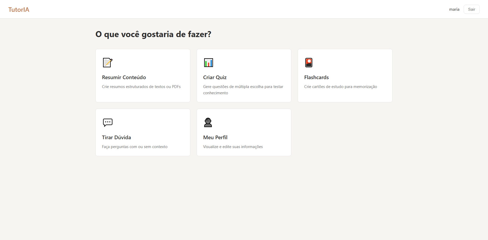

### Resumir
#### Texto de Apoio (Contexto)
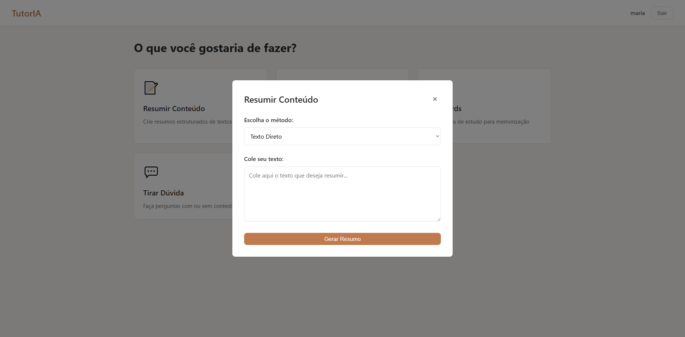

#### PDF
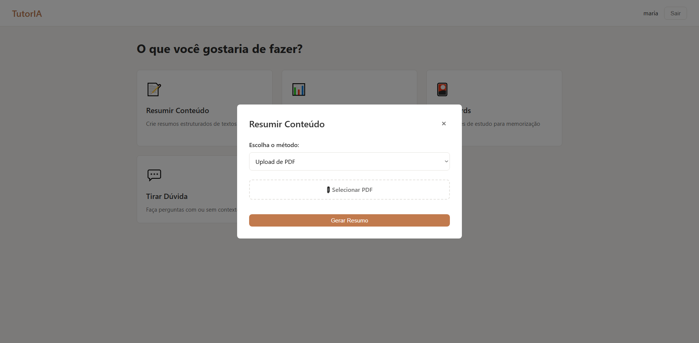

#### Exemplo
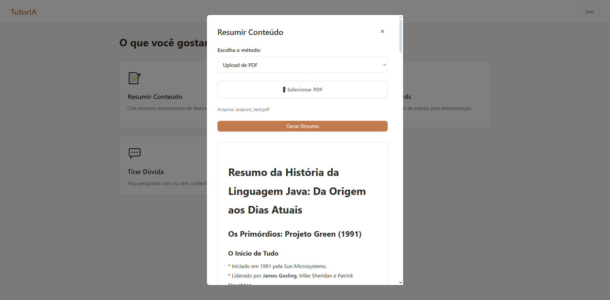

### Quiz
#### Texto de Apoio (Contexto)
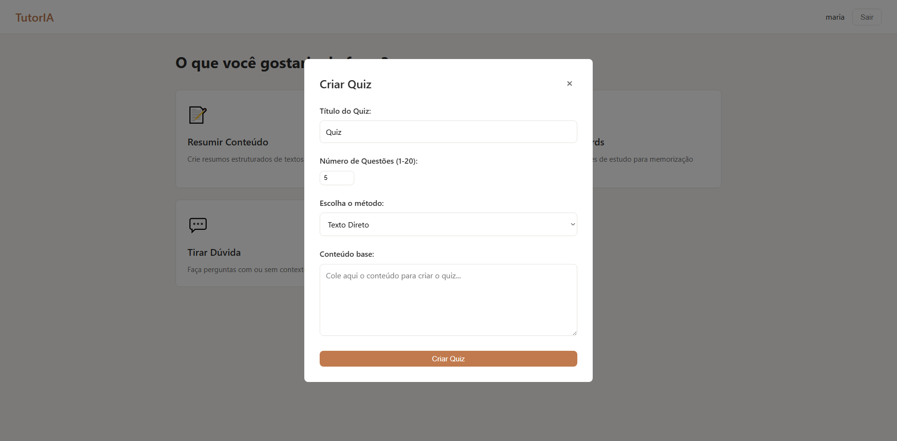

#### PDF


#### Exemplo


### Flashboard
#### Texto de Apoio (Contexto)
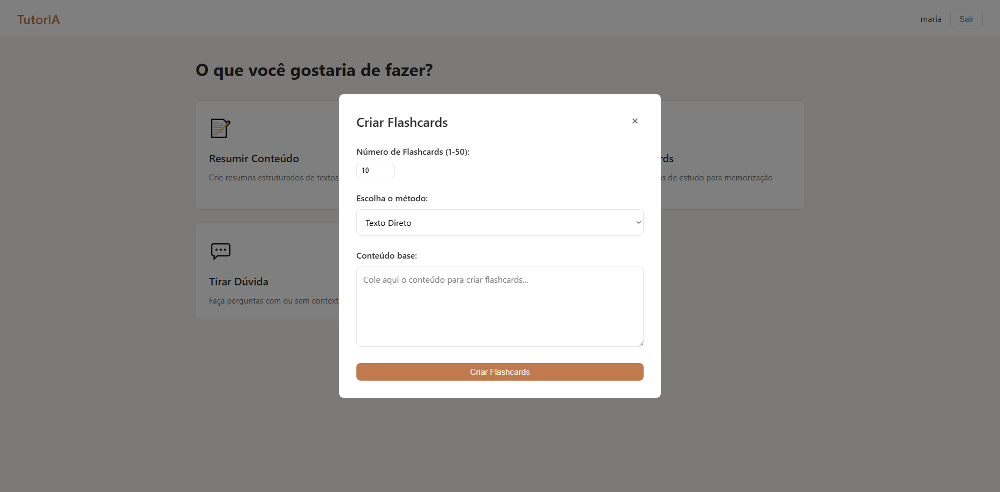

#### PDF
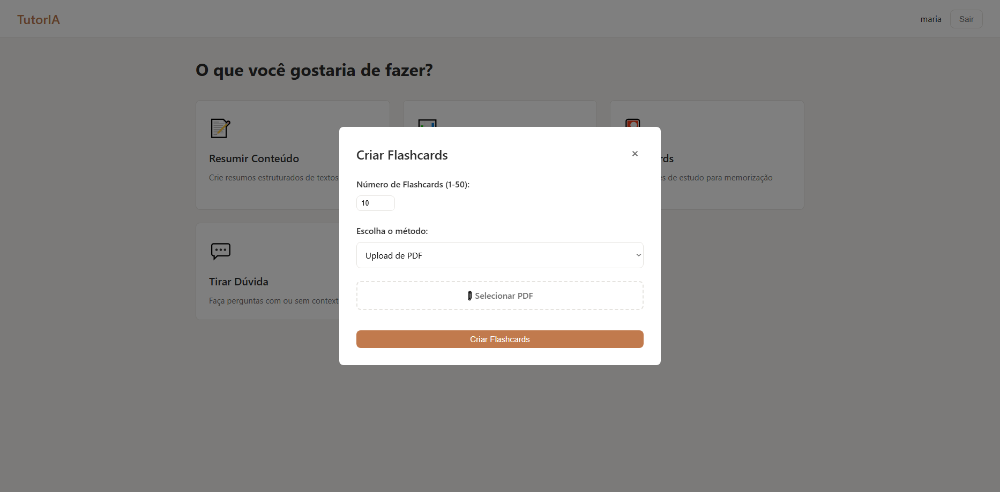

#### Exemplo
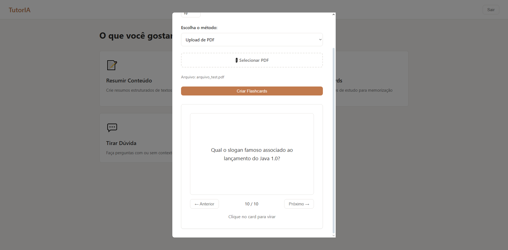

### Dúvidas
#### Dúvida Simples
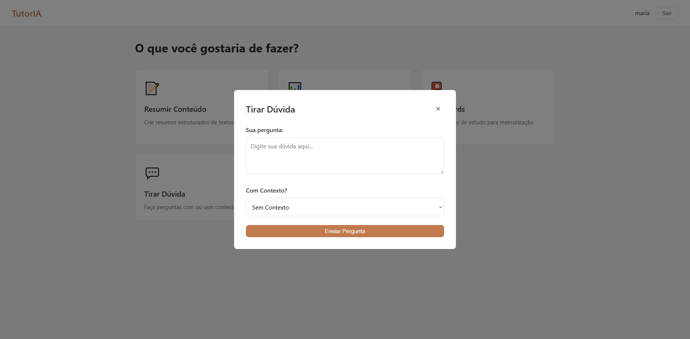

#### Texto de Apoio (Contexto)

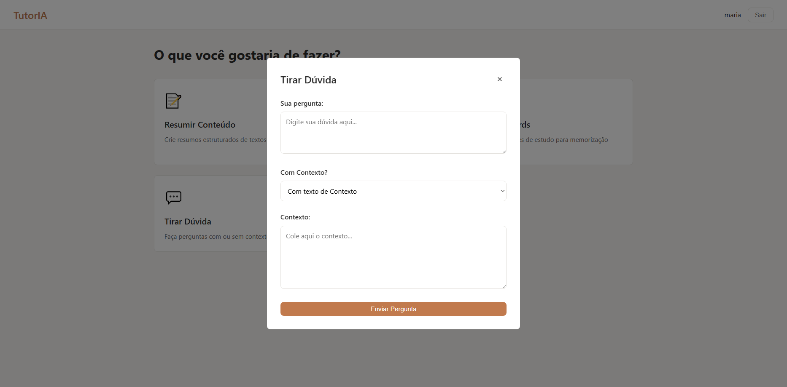

#### PDF
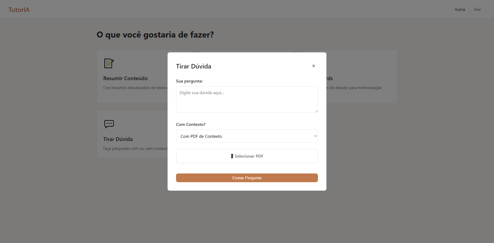

#### Exemplo
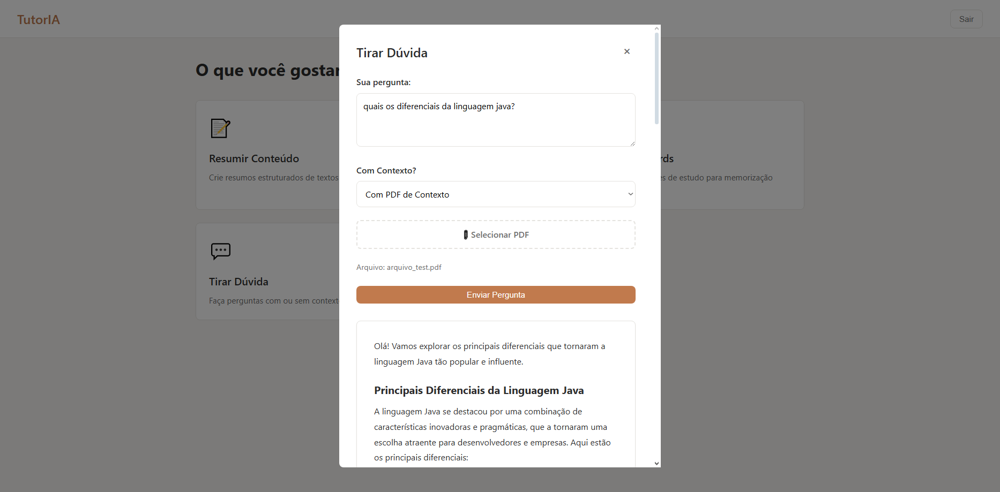

### Perfil


### Login
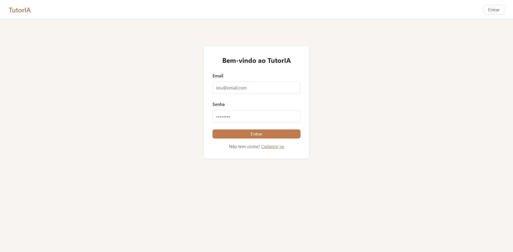

### Registro
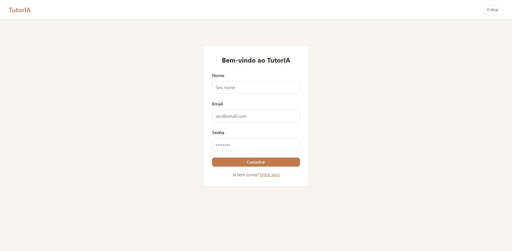

